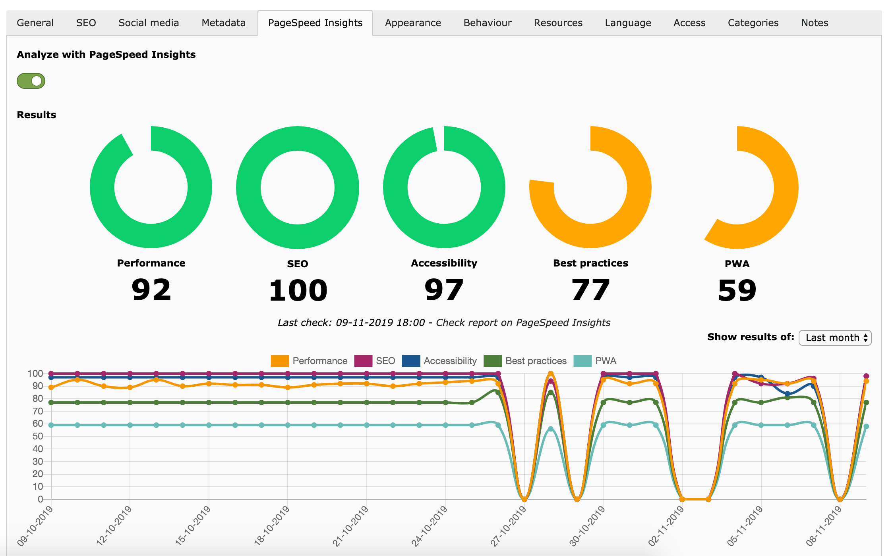

.. include:: ../Includes.txt

.. _introduction:

============
Introduction
============

The performance of your website is important for several reasons. The most important one is that if a page is to slow
you will lose visitors. Studies showed that over 50% of the people will leave a page that takes longer than three
seconds to load.

As this is important for users, it is important for search engines as well. Search engines want to give the user the
best results possible. If a search engines have to choose between two results that both are interesting for a user, the
fastest one will definitely have a higher change to rank over the other result.

.. _what-it-does:

What does it do?
================

This extension will give you the possibility to check your TYPO3 pages with PageSpeed Insights. The performance of your
page is checked with Lighthouse and will give you an indication of the performance of your page. Besides performance
you will also get your Lighthouse scores for SEO, Accessibility, Best practices and PWA.

.. _screenshots:

Screenshots
===========

.. figure:: ../Images/ScreenshotPageModule.png
   :class: with-shadow
   :alt: Scores shown in page module
   :width: 500px

   PageSpeed Insights results as shown in the page module

   PageSpeed Insights results and history are shown in the page properties

